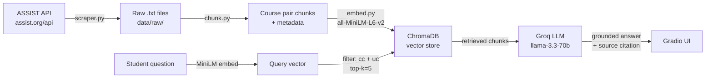

# Project 1 Planning: The Unofficial Guide

> Write this document before you write any pipeline code.
> Your spec and architecture diagram are what you'll use to direct AI tools (Claude, Copilot, etc.) to generate your implementation — the more specific they are, the more useful the generated code will be.
> Update the Retrieval Approach and Chunking Strategy sections if you change your approach during implementation.
> Update this file before starting any stretch features.

---

## Domain

California community college transfer articulation agreements to UC campuses.
Specifically: which CC courses satisfy which UC major preparation requirements,
and which courses satisfy General Education / IGETC requirements.

This knowledge exists on ASSIST.org but is extremely hard to navigate — a student
has to know which school to select, which major to look under, which year's
agreement applies, and how to read the articulation tables. There is no way to
simply ask "does my Calc 2 count?" and get a direct answer. This system makes
that possible.

---

## Documents

All documents are generated by scraping the ASSIST.org API. Each file represents
one articulation agreement: one CC, one UC campus, one major or GE area.

File naming convention: `{CC_Name}_{UC_Name}_{Major}.txt`
Example: `American_River_College_UC_Davis_Computer_Science.txt`

| # | Source | Description | URL or location |
|---|--------|-------------|-----------------|
| 1 | ASSIST.org API | ARC → UC Davis Computer Science articulation | https://assist.org/api/agreements?receivingInstitutionId=79&sendingInstitutionId=4&academicYearId=75&categoryCode=major |
| 2 | ASSIST.org API | ARC → UC Davis Mathematics articulation | Same API, different major key |
| 3 | ASSIST.org API | ARC → UC Davis Physics articulation | Same API, different major key |
| 4 | ASSIST.org API | ARC → UC Davis Biology articulation | Same API, different major key |
| 5 | ASSIST.org API | ARC → UC Davis Chemistry articulation | Same API, different major key |
| 6 | ASSIST.org API | ARC → UC Davis Economics articulation | Same API, different major key |
| 7 | ASSIST.org API | ARC → UC Davis Psychology articulation | Same API, different major key |
| 8 | ASSIST.org API | ARC → UC Davis English articulation | Same API, different major key |
| 9 | ASSIST.org API | ARC → UC Davis IGETC/GE articulation | Same API, categoryCode=ge |
| 10 | ASSIST.org API | ARC → UC Davis Political Science articulation | Same API, different major key |

Institution IDs:
- American River College (ARC) = institution ID **4**
- UC Davis = institution ID **79**
- 2024–25 academic year = year ID **75**

Estimated document count: 10–30 files for ARC → UC Davis scope.
Each document contains between 10 and 200 course equivalency pairs.

---

## Chunking Strategy

Documents consist of structured course equivalency pairs, not prose paragraphs.
Each pair looks like:

```
UC course:  MAT 021B - Calculus
CC course:  MATH 400 - Calculus II
```

Each pair is one atomic unit of knowledge — it cannot be split without destroying
its meaning. A chunk containing only the UC side has no value on its own. A chunk
containing only the CC side has no value on its own. Only together do they answer
a student's question.

**Chunk size:** ~80–160 characters (naturally determined by course names, not a fixed number)

**Overlap:** None. Pairs are independent — the calc equivalency has no relationship
to the chemistry equivalency above or below it. Overlap would add noise, not context.

**Reasoning:**
Fixed-size chunking is wrong for this data. Fixed 500-character chunks would
routinely split pairs across chunk boundaries, or merge multiple unrelated pairs
into one chunk. Either way, retrieval breaks. A query for "calculus equivalency"
should return exactly the calculus pair — not half of it, and not calculus merged
with discrete math and chemistry.

Each chunk also stores metadata:
```python
{
    "cc_name": "American River College",
    "uc_name": "UC_Davis",
    "major": "Computer_Science"
}
```

How bad chunking shows up:
- Too small (splitting pairs): retrieval returns half a pair, LLM says "I don't have
  enough information" even though the data exists.
- Too large (merging pairs): retrieval returns a chunk with 10 course pairs, the LLM
  has to hunt through it, and the distance score is diluted because the chunk covers
  too many topics at once.

---

## Retrieval Approach

**Embedding model:** all-MiniLM-L6-v2 via sentence-transformers.
Runs locally — no API key, no rate limits, no cost. Vector dimensions: 384.

**Top-k:** 5

Why 5? A student asking about one course needs maybe 1–3 results. But questions
like "what do I need for CS major prep?" might need 10+ pairs. Starting at 5
is a reasonable middle ground — enough context for multi-course questions,
not so many that unrelated pairs dilute the answer.

Why semantic search works here even without exact word matches:
A student types "does my calc 2 count?" — none of those words appear in
"MAT 021B - Calculus" or "MATH 400 - Calculus II". But the embedding model
was trained on enough math text to know that "calc 2", "Calculus II", and
"MAT 021B" are semantically related. Their vectors land close together in
the 384-dimensional space, so ChromaDB finds them.

Metadata filtering before semantic search:
Because we store chunks across multiple schools, we filter by `cc_name` and
`uc_name` before running semantic similarity. This narrows the search to only
the chunks relevant to that student's specific school pair, improving both
speed and accuracy.

**Production tradeoff reflection:**
- `text-embedding-3-large` (OpenAI): higher accuracy, especially on
  domain-specific course names, but costs money per embedding and requires
  an API call — not viable for a one-time bulk embed on a student budget.
- `multilingual-e5-large`: better for Spanish-speaking students whose queries
  might mix English and Spanish, but slower and larger.
- `all-MiniLM-L6-v2` is the right choice here: fast, free, local, and accurate
  enough for short structured text like course names.

---

## Evaluation Plan

All test questions are for American River College → UC Davis articulation,
2024–25 academic year. Expected answers to be verified manually on ASSIST.org.

| # | Question | Expected answer |
|---|----------|-----------------|
| 1 | Does MATH 400 at ARC satisfy MAT 021B (Calculus) at UC Davis? |No|
| 2 | What ARC courses satisfy the CS major preparation requirement for ECS 020 (Discrete Mathematics) at UC Davis? |CISP 440|
| 3 | Does completing IGETC at ARC fully satisfy UC Davis lower division General Education requirements? | Yes |

| 4 | What ARC course satisfies PHY 009A (Introductory Physics) at UC Davis for the Physics major? | PHYS 410 |
| 5 | Is there an ARC course equivalent to ECS 036A (Programming and Problem Solving) at UC Davis? |CISP 360 or CISP 480|

---

## Anticipated Challenges

1. **Not all CC/UC pairs have agreements.** Many CCs have no articulation agreement
   with certain UC campuses. The scraper needs to handle 404 responses gracefully
   and skip those pairs silently rather than crashing.

2. **Course name variations breaking retrieval.** A student might type "ARC MATH 400"
   or just "calculus 2" or "second semester calc". The embedding model handles natural
   language variation well, but highly abbreviated queries ("MATH 400 → UCD?") may not
   embed close enough to the stored text to retrieve correctly.

3. **Metadata filter errors silently returning no results.** If a student's CC name
   doesn't exactly match the stored `cc_name` in ChromaDB (e.g. "ARC" vs
   "American River College"), the filter returns zero chunks and the LLM says it
   doesn't know — even though the data is there. Fix: normalize school names at
   both storage and query time.

4. **ASSIST API structure changing.** The scraper depends on undocumented API endpoints.
   If ASSIST updates their frontend, the JSON structure may change and the parser breaks
   silently, producing empty documents. Mitigation: validate that scraped files are
   non-empty and contain the expected fields before embedding.

---

## Architecture



---

## AI Tool Plan

**Milestone 3 — Ingestion and chunking:**
I will give Claude the ASSIST API endpoint structure, my Documents section,
and the JSON response format from a sample API call. I will ask it to implement
`get_all_institutions()`, `get_majors()`, `get_articulation()`, and
`articulation_to_text()`. I will verify the output files contain real course
pairs before using them downstream.

For chunk.py: I will give Claude my Chunking Strategy section and one sample
document file. I will ask it to implement `chunk_by_pair()` which splits on the
blank line between pairs and attaches `cc_name`, `uc_name`, and `major` as
metadata to each chunk. I will print 10 sample chunks and verify no pair is split.

**Milestone 4 — Embedding and retrieval:**
I will give Claude my Retrieval Approach section and ask it to implement
`build_vector_store()` using sentence-transformers and ChromaDB, storing metadata
fields `cc_name`, `uc_name`, and `major` on every chunk. I will verify by querying
ChromaDB directly and checking that metadata is attached.

**Milestone 5 — Generation and interface:**
For query.py: I will give Claude my grounding requirement and ask it to write the
prompt template and the `ask()` function. I will test it by asking a question I
already know the answer to and checking that the response matches and cites the
correct source file.

For app.py: I will give Claude the `ask()` function signature and ask it to build a
Gradio interface with inputs for CC name, UC name, and question, and outputs for
answer and source files. I will verify the filter fields correctly pass `cc_name`
and `uc_name` to the retrieval function.
